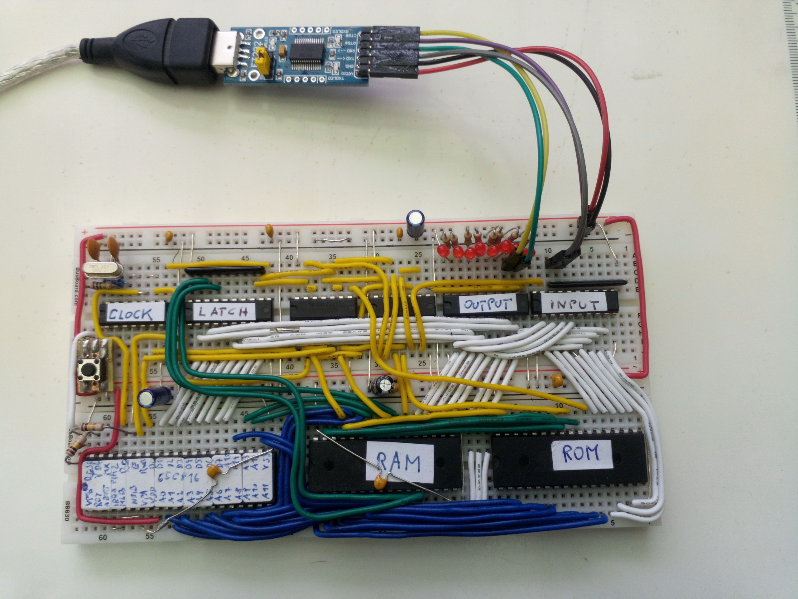

# OS816

A small breadboard circuit to use the 65C816 processor running at 12MHz, together with 512KB of RAM, 512KB of Flash
and a simple but effective I/O circuitry.

I made a small boot loader program for this hardware sitting in the top 4KB of Flash to upload further
code via a serial connection to avoid the need of swapping the Flash IC in and out of the board all the time.

User programs can be developed with the WDC C compiler tool chain that supports basically the C89/90 standard
(a.k.a ANSI C). I had to fix some bugs and add implementations for stdin/stdout over serial and file access
to utilize the unoccupied area of the Flash memory. By now it is complete enough to run the "frotz" 
interactive fiction interpreter.

## 65C816 reference setup

This processor is a tricky beast to use in a circuit as it has some unusual quirks that need consideration,
especially when you want to use more than 64KB of address space.

1. RD and WR signals need to be externally generated.
2. Address bits 16-23 are multiplexed with the data bus.
3. Difficult to use flat RAM and ROM areas, as both the stack as well as the initial boot code needs to be 
placed in bank 0.

Points 1 and 2 are just solved with some extra logic on the board. Point 3 is solved by using the emulation bit
to force the data bank address to $FF during startup time. Once the program is running it switches to native mode
to make use of the full address range with flat regions for both RAM, IO and ROM.

## Memory map

| from   | to     | type 
| ------ | ------ | -----------------
| 000000 | 07FFFF | RAM
| 7Fxxxx | 7Fxxxx | IO
| 800000 | 87EFFF | User flash
| FFF000 | FFFFFF | Boot loader flash

All other ranges of the 16MB space are mirrors of some of the specified ranges here, but should not 
be used to allow future extensions.

## Compiling for the platform

The WDC compiler tools (running on Windows only) are used that include a C compiler, so it is easy to
get things done without directly touching the 65C816 machine code. The OS816 libraries are designed
for the "large" memory model to evenly access static and dynamic data without bothering
about banks, direct page and all the other intricate details of this specific CPU.
Low level access to the hardware (essentially to the IO port, but also the flash programming functions) 
is provided by libraries that are directly written in machine code for best performance and because sometimes it would not be 
possible otherwise.

The necessary compiler and linker can be found at the Western Design Center's
[download page](https://www.westerndesigncenter.com/wdc/tools.php).
Additionally you need a [python 3 interpreter](https://www.python.org/downloads/) to run my extra build tools.

To see how all these tools should be used, have a look at the build scripts for the various examples provided.

## Uploading 

Compiling with the recommended tools will create a file in Intel HEX format. This file contains the "user code" which can be 
written to the Flash using the resident boot loader program. When starting up the machine with a serial terminal attached,
the boot loader enters a command line interface. Here memory locations can be inspected or modified and also the content
of the flash can be reprogrammed. After completely erasing the user flash area with the "!" command, you can conveniently 
dump a whole intel hex file into the terminal whose lines will be treated as individual programming commands.
Once the user program is in the flash, the command "x" will start up this program. 
When the machine starts up with a user program already installed, the boot loader will give you 1 second 
time to enter the command line interface by pressing a key. Otherwise it will fire up the user program directly.

## Serial interface

With its simple IO hardware, the CPU is in charge of all signal handling. With a 12Mhz clock and handcrafted machine code
it was possible to implement a reliable serial communication that can run at 115.2kHz (1 start bit, 1 stop bit, no parity). 
But as the CPU can not do any communication when being busy with other things it is necessary that the 
communication partner must only send data when the CPU is prepared to receive it. A straight forward solution 
is the use of hardware flow control using RTS/CTS handshake lines. In my reference setup I use a cheap USB-to-UART 
interface board with support for these signals.

| Pin location | OS816 | Partner |
| ------------ | ----- | ------- |
| OUTPUT 0     | TX    | RX      |
| OUTPUT 1     | RTS   | CTS     |
| INPUT  7     | RX    | TX      |
| INPUT  6     | CTS   | RTS     |

## Performance hints

The C compiler internally uses the 16 bit register mode of the CPU, so working
with 16 bit integers is the default and most optimized option. Using 8-bit values for
local variables or parameters instead only degrades performance. 

Function calls have a pretty high overhead, so maybe it makes sense to inline 
certain things using macros.
