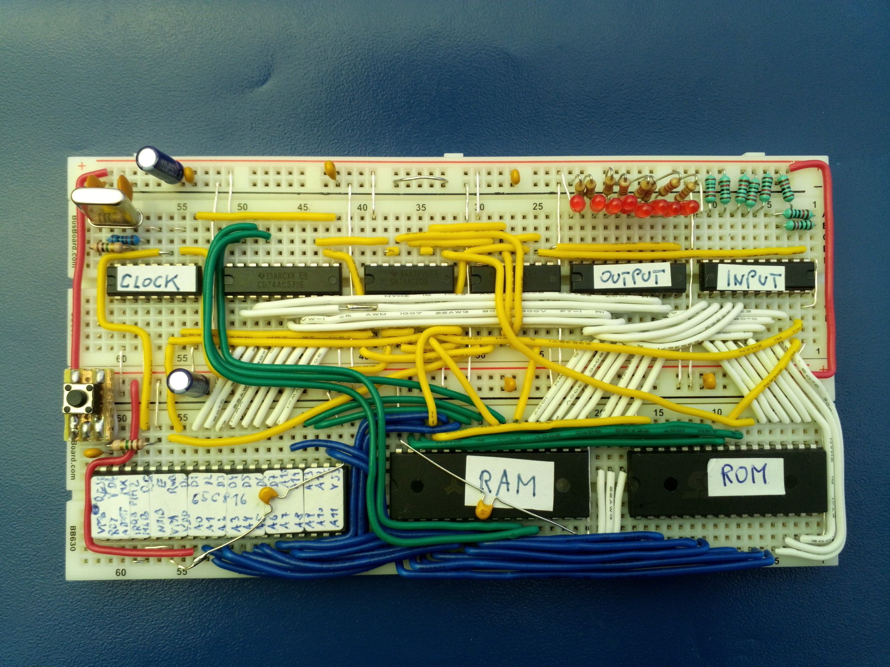

# OS816

A small breadboard circuit to use the 65C816 processor and a tiny operating system
(in fact just some startup code and a few libraries) to run on it.
This project also provides some examples (starting with the most basic LED animation) 
to use these libraries and actually get the WDC tool chain to work.

## 65C816 reference setup

This processor is a tricky beast to use in a circuit as it has some unusual quirks that need consideration,
especially when you want to use more than 64KB of address space.

1. RD and WR signals need to be externally generated.
2. Address bits 16-23 are multiplexed with the address bus.
3. Difficult to use flat RAM and ROM areas, as both the stack as well as the initial boot code needs to be 
placed in bank 0.

Points 1 and 2 are just solved with some extra logic on the board. Point 3 is solved by using the emulation bit
to change the memory map at startup time. Once the program is running it switches to native mode to execute code
from the high address, using a flat 512KB address range for the RAM.

## Compiling for the platform

The WDC compiler tools are used that include a C compiler, so it is possible to
get things done without directly touching the 65C816 machine code. By sacrificing 
some optimization options, it is possible to make a system that can utilize the whole
RAM and ROM of the system without bothering with banks, direct pages and all those
intricate details of this particular CPU.
Access to the hardware (essentially to the IO port) is provided by libraries that are directly
written in machine code for best performance and because sometimes it would not be 
possible otherwise.

## Performance hints

* The C compiler internally uses the 16 bit register mode of the CPU, so working
with 16 bit integers is the default and most optimized option. Using 8-bit values for
local variables or parameters instead only degrades performance. 

* Function calls have a pretty high overhead, so maybe it makes sense to inline 
certain things using macros.

